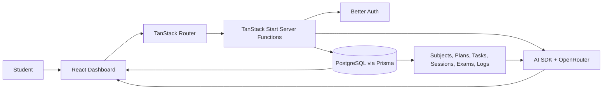

# Shikshya Plan

## Academic Project Presentation

> Replace the bracketed details on Slide 1 before presenting.

---

## Slide 1: Title Slide

- **Project:** Shikshya Plan
- **Subtitle:** AI-Powered Study Planning and Academic Productivity Platform
- **Presented by:** [Team member names]
- **Institution / Course:** [Institution and course]
- **Date:** [Presentation date]

**Suggested visual:** Project logo or a clean screenshot of the dashboard.

**What to say:**

> Shikshya Plan is a web-based study management platform that helps students organize academic work, plan study time, track progress, and receive AI-assisted guidance in one place.

---

## Slide 2: Introduction

- Students often manage subjects, assignments, exams, and study sessions separately.
- Shikshya Plan combines these activities in one authenticated dashboard.
- Students can create plans, schedule sessions, manage tasks, and monitor analytics.
- AI features provide personalized planning, explanations, quizzes, and recommendations.

**Suggested visual:** Dashboard screenshot showing the main navigation and study overview.

**What to say:**

> The project brings everyday academic planning into a single workspace. It combines standard productivity tools with AI assistance so students can plan and make better decisions about what to study next.

---

## Slide 3: Problem Statement

- Students may lack a clear and consistent study routine.
- Important tasks and exam preparation can be difficult to prioritize.
- Study progress is often tracked manually or not tracked at all.
- Missed sessions and incomplete tasks can make the schedule difficult to recover.
- Generic advice does not always reflect a student’s actual workload and activity.

**Suggested visual:** Simple illustration of scattered notes, deadlines, and study schedules.

**What to say:**

> The main problem is not only storing academic information. Students also need help converting that information into a realistic plan, maintaining consistency, and adapting when their schedule changes.

---

## Slide 4: Objectives

- Provide one platform for subjects, plans, sessions, tasks, exams, and goals.
- Help students create and maintain an organized study schedule.
- Track study time, task completion, Pomodoro activity, and progress trends.
- Use AI to generate personalized academic guidance.
- Protect user data through authentication and user-owned records.

**Suggested visual:** Five-icon objective row: organize, schedule, track, assist, protect.

**What to say:**

> The objectives focus on organization, personalization, measurable progress, and secure access. The project is designed to support the complete study-planning cycle rather than only one task-management feature.

---

## Slide 5: Proposed Solution

- A protected student dashboard acts as the central workspace.
- Subjects connect related plans, sessions, tasks, exams, and study logs.
- AI uses the student’s request and relevant academic data to generate guidance.
- Generated plans and task suggestions can be reviewed before saving.
- Analytics convert activity records into understandable progress feedback.

**Suggested visual:** High-level diagram: Student data -> Dashboard -> Planning and AI assistance -> Progress feedback.

**What to say:**

> The solution combines structured academic data with AI assistance. Normal CRUD features keep information organized, while AI features help interpret that information and produce useful next actions.

---

## Slide 6: Technology Stack

- **Frontend:** React 19 with TanStack Start and TanStack Router.
- **Language and styling:** TypeScript and Tailwind CSS.
- **Backend/data access:** TanStack Start server functions.
- **Database:** PostgreSQL with Prisma ORM and generated Prisma client.
- **Authentication:** Better Auth with protected private routes.
- **AI integration:** Vercel AI SDK with OpenRouter models and structured Zod validation.
- **Tooling:** Bun, Vite, Biome, and Vitest.

**Suggested visual:** Technology logos arranged by frontend, backend, data, AI, and tooling.

**What to say:**

> The stack is TypeScript-based from the user interface through server functions. Prisma manages the PostgreSQL data model, Better Auth protects user data, and the AI SDK connects the application to configurable OpenRouter models.

---

## Slide 7: System Architecture and Working Flow

- The student interacts with the React dashboard.
- Protected routes verify authentication before accessing private data.
- Server functions validate requests and perform database operations.
- AI functions use selected user context and return validated structured results.
- The dashboard displays plans, tasks, analytics, and recommendations.

**Suggested visual:** Use the diagram above as the architecture slide.

**What to say:**

> The browser communicates with the application through TanStack Router and server functions. Authentication is checked on protected operations. Prisma reads and writes PostgreSQL data, while AI actions use selected user data and return structured responses for the interface.

---

## Slide 8: Key Features

- **Academic management:** Subjects, study plans, sessions, tasks, exams, goals, and calendar views.
- **Progress tools:** Analytics, study logs, task completion, Pomodoro tracking, and exam readiness.
- **AI Study Plan Generator:** Creates practical multi-day study schedules.
- **AI Study Coach:** Tutor explanations, task breakdown, quizzes, and exam insights.
- **Smart assistance:** Natural-language task creation, missed-schedule adjustment, and analytics summaries.
- **User experience:** Onboarding, profile/settings, responsive layout, browser reminders, and password recovery.

**Suggested visual:** A 2x3 screenshot grid: AI page, tasks, calendar, exams, analytics, and dashboard.

**What to say:**

> The important point is the combination of standard planning features and AI workflows. Each AI feature supports a different student need: planning, understanding, practice, prioritization, recovery, or reflection.

---

## Slide 9: Working Example and Output

- A student enters a focus such as “Prepare for my nearest exam.”
- The AI generates a plan with daily focus areas and tasks.
- The student can select tasks and save them under a subject.
- A natural-language request can create a task with title, date, priority, and subject.
- Analytics and AI summaries explain activity patterns and recommend next steps.

**Suggested visual:** Show the AI Study Coach page before and after generating a study plan. Also show a saved task or analytics summary.

**What to say:**

> This demonstrates the complete workflow: the student gives a goal, receives a structured recommendation, reviews it, and turns useful items into actionable study tasks. Progress can then be tracked through sessions, logs, and analytics.

---

## Slide 10: Advantages, Applications, and Future Scope

- **Advantages:** Centralized planning, personalized support, progress visibility, and schedule recovery.
- **Applications:** Individual study planning, exam preparation, assignment management, and academic progress tracking.
- **Scalable foundation:** User-owned relational data can support additional study workflows.
- **Future scope:** Calendar synchronization, richer AI conversation history, notes-based tutoring, and automatic approved schedule updates.
- **Future scope:** Mobile or progressive web app support and broader testing/deployment automation.

**Suggested visual:** Three-column layout: Advantages, Applications, Future Scope.

**What to say:**

> The current system is suitable for students who need a structured study workspace. Future improvements should focus on deeper integrations, more context-aware AI, mobile access, and stronger automated testing.

---

## Slide 11: Conclusion

- Shikshya Plan unifies academic organization and AI-assisted study support.
- It covers planning, execution, tracking, exam preparation, and reflection.
- The system uses real user data to make recommendations more relevant.
- The project provides a practical foundation for a student productivity platform.
- The core application builds and is ready for final manual workflow validation.

**Suggested visual:** Final dashboard screenshot with the project name and a short “Plan. Study. Improve.” tagline.

**What to say:**

> In conclusion, Shikshya Plan addresses the practical difficulty of organizing and sustaining academic work. By combining a structured study-management system with AI coaching, it helps students turn academic goals into clear, trackable actions.

---

# Short Project Introduction

Shikshya Plan is an AI-powered study planning and academic productivity web application. It allows students to manage subjects, study plans, sessions, tasks, exams, goals, and study progress from one secure dashboard. The system also provides AI-generated study plans, task breakdowns, exam insights, tutoring, quizzes, schedule adjustments, natural-language task creation, and analytics summaries. Its purpose is to help students organize their workload, study more consistently, and make informed decisions about their next academic activity.

# Important Information Missing

- Team member names
- Institution, department, and course name
- Supervisor or instructor name
- Final deployment URL, if available
- Real user-testing results or performance measurements
- Final screenshots from the running application

Do not claim user adoption, accuracy percentages, or performance improvements unless those results have been measured and documented.
